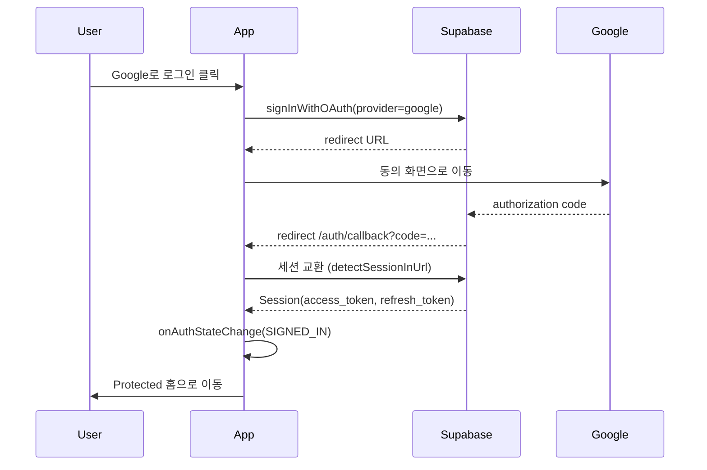

# Reading Log — Supabase Auth (Google) 설계

## 개요

- Provider: **Google OAuth 2.0** (Supabase Auth)
- Flow: **Authorization Code + PKCE**
- 클라이언트: `@supabase/supabase-js` (`autoRefreshToken`, `persistSession`, `detectSessionInUrl`)
- 앱 상태: `AuthProvider` + `useAuth`

---

## 로그인 Flow



1. `signInWithGoogle()` → `auth.signInWithOAuth({ provider: 'google', redirectTo })`
2. Google 동의 후 Supabase가 `/auth/callback`으로 리다이렉트
3. 콜백 페이지에서 세션 확정 (성공 시 `/`, 실패 시 `/login?error=...`)
4. `users` 테이블은 `auth.users` INSERT 트리거로 자동 생성

### Supabase 콘솔 설정

- Authentication → Providers → **Google** 활성화 (Client ID/Secret)
- URL Configuration:
  - Site URL: `http://localhost:5173` (배포 시 실제 도메인)
  - Redirect URLs: `http://localhost:5173/auth/callback`

---

## 로그아웃

1. `signOut()` → `auth.signOut({ scope: 'local' })`
2. 로컬 세션·storage 제거
3. `onAuthStateChange(SIGNED_OUT)` → Context `session/user = null`
4. Public Route(`/login`)로 이동

예외: 네트워크 실패 시에도 로컬 세션을 정리하고 로그인 화면으로 보냄 (UX 우선).

---

## Session 관리

| 항목 | 동작 |
|---|---|
| 초기화 | `getSession()`으로 storage에서 복원 |
| 구독 | `onAuthStateChange`로 동기화 |
| 저장소 | `localStorage` (기본) |
| 유효성 | `session.expires_at` / JWT exp |
| 로딩 | 초기 `getSession` 완료 전까지 `isLoading=true` |

이벤트 처리:

| Event | 앱 동작 |
|---|---|
| `INITIAL_SESSION` / `SIGNED_IN` | session 설정 |
| `TOKEN_REFRESHED` | 새 session으로 교체 |
| `SIGNED_OUT` | session 초기화 |
| `USER_UPDATED` | user/session 갱신 |

---

## Refresh Token

- Supabase JS가 **만료 임박 시 자동 refresh** (`autoRefreshToken: true`)
- 수동 복구: `refreshSession()` → `auth.refreshSession()`
- Refresh 실패(`refresh_token_not_found`, `invalid_grant` 등):
  1. 로컬 세션 clear
  2. `AuthError` 기록
  3. `/login`으로 유도 (Protected Route)

---

## Route 가드

### Protected Route

- 대상: `/`, `/books`, `/memos/new`, `/tags`, `/graph`, `/streak` …
- `isLoading` → Spinner
- `!user` → `/login` (+ `state.from`에 원래 경로 저장)
- `user` → `<Outlet />`

### Public Route

- 대상: `/login`
- `isLoading` → Spinner
- `user` → `state.from` 또는 `/`로 리다이렉트 (이미 로그인)
- `!user` → `<Outlet />`

### Callback Route

- `/auth/callback` — 세션 교환 전용 (가드 없음, 짧은 로딩 화면)

---

## Auth Context

```ts
type AuthContextValue = {
  session: Session | null
  user: User | null
  isLoading: boolean
  isAuthenticated: boolean
  error: AppError | null
  clearError: () => void
  signInWithGoogle: () => Promise<void>
  signOut: () => Promise<void>
  refreshSession: () => Promise<Session | null>
}
```

---

## useAuth Hook

```ts
const {
  user,
  session,
  isLoading,
  isAuthenticated,
  error,
  clearError,
  signInWithGoogle,
  signOut,
  refreshSession,
} = useAuth()
```

- Provider 밖에서 호출 시 명확한 에러 throw
- UI는 이 훅만 사용 (supabase.auth 직접 호출 금지)

---

## 예외처리 매트릭스

| 상황 | 코드/신호 | 사용자 메시지 | 앱 동작 |
|---|---|---|---|
| env 미설정 | `AUTH_CONFIG` | 인증 설정이 필요합니다 | 로그인 버튼 비활성 + 안내 |
| OAuth 시작 실패 | AuthApiError | 로그인에 실패했습니다 | 에러 표시, 페이지 유지 |
| 사용자가 Google 동의 취소 | `access_denied` | 로그인이 취소되었습니다 | `/login` |
| 콜백 code 교환 실패 | URL `error` / exchange fail | 로그인 인증에 실패했습니다 | `/login?error=` |
| 콜백 타임아웃 | `AUTH_CALLBACK_TIMEOUT` | 세션을 확인하지 못했습니다 | `/login` |
| 세션 없음 + Protected | — | — | `/login` |
| Refresh 실패 | `refresh_token_*` | 세션이 만료되었습니다 | 로그아웃 처리 → `/login` |
| 로그아웃 API 실패 | network | (조용히) | 로컬 clear 후 `/login` |
| Provider 미사용 | — | useAuth must be used within AuthProvider | throw |

---

## 파일 위치

| 역할 | 경로 |
|---|---|
| 설계 문서 | `supabase/AUTH.md` |
| Client | `src/shared/lib/supabase/client.ts` |
| Auth API | `src/features/auth/api/auth.api.ts` |
| Auth Errors | `src/features/auth/api/auth.errors.ts` |
| Context | `src/app/providers/AuthProvider.tsx` |
| Hook | `src/features/auth/hooks/useAuth.ts` |
| Protected | `src/app/router/ProtectedRoute.tsx` |
| Public | `src/app/router/PublicRoute.tsx` |
| Callback | `src/pages/AuthCallbackPage.tsx` |
| Login UI | `src/features/auth/components/LoginForm.tsx` |
